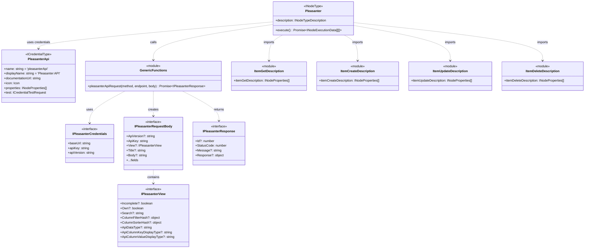
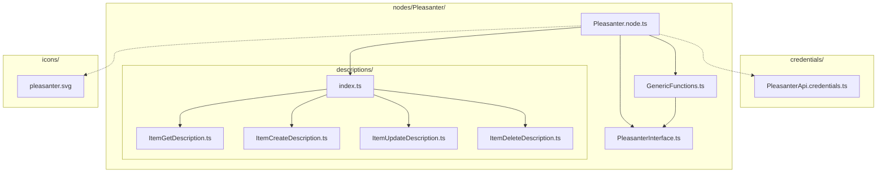

# n8n カスタムノード - Pleasanter API 仕様書

## 概要

本ドキュメントは、n8n用のPleasanter APIカスタムノードを作成するための仕様書です。
AIエージェントがこの仕様に基づいてアプリケーションを自動生成することを目的としています。

---

## 1. プロジェクト構成

### 1.1 フォルダ構成

```
./
├── custom-node/
│   └── n8n-node-pleasanter/           # カスタムノードプロジェクト（ソースコード）
│       ├── package.json               # パッケージ設定
│       ├── tsconfig.json              # TypeScript設定
│       ├── .prettierrc.js             # Prettier設定
│       ├── eslint.config.mjs          # ESLint設定
│       ├── icons/
│       │   └── pleasanter.svg         # ノードアイコン
│       ├── nodes/
│       │   └── Pleasanter/
│       │       ├── Pleasanter.node.ts           # メインノードクラス
│       │       ├── PleasanterInterface.ts       # 型定義・インターフェース
│       │       ├── GenericFunctions.ts          # API呼び出し共通関数
│       │       └── descriptions/
│       │           ├── index.ts                 # descriptions エクスポート
│       │           ├── ItemGetDescription.ts    # Get操作のプロパティ定義
│       │           ├── ItemCreateDescription.ts # Create操作のプロパティ定義
│       │           ├── ItemUpdateDescription.ts # Update操作のプロパティ定義
│       │           └── ItemDeleteDescription.ts # Delete操作のプロパティ定義
│       ├── credentials/
│       │   └── PleasanterApi.credentials.ts     # 認証情報定義
│       └── dist/                                # ビルド出力先
├── volume/                                      # n8nデータディレクトリ（Dockerマウント先）
│   └── custom-nodes/                            # カスタムノード配置先（N8N_CUSTOM_EXTENSIONS）
│       └── n8n-nodes-pleasanter/                # カスタムノードのデプロイ先
│           ├── dist/                            # ビルド成果物
│           └── package.json
├── docker-compose.yml                           # n8n実行環境構築用
├── deploy.ps1                                   # デプロイスクリプト（Windows）
├── deploy.sh                                    # デプロイスクリプト（Linux/Mac）
├── README.md                                    # プロジェクト説明
└── spec.md                                      # 本仕様書
```

### 1.2 セットアップ手順

1. カスタムノードのひな形をClone
   ```bash
   mkdir -p custom-node
   cd custom-node
   git clone https://github.com/n8n-io/n8n-nodes-starter.git n8n-node-pleasanter
   cd n8n-node-pleasanter
   ```

2. 不要なサンプルコードの削除
   - `nodes/Example/` フォルダを削除
   - `nodes/GithubIssues/` フォルダを削除
   - `credentials/GithubIssuesApi.credentials.ts` を削除
   - `credentials/GithubIssuesOAuth2Api.credentials.ts` を削除
   - `icons/github.svg` を削除
   - `icons/github.dark.svg` を削除
   - `package.json` のサンプル参照を削除・更新

3. 依存関係のインストール
   ```bash
   npm install
   ```

4. ビルド
   ```bash
   npm run build
   ```

5. ビルド成果物を `./volume/nodes/n8n-nodes-pleasanter` にコピー

---

## 2. クラス設計

### 2.1 クラス構成図



### 2.2 ファイル構成図



### 2.2 認証情報（Credentials）

**ファイル**: `credentials/PleasanterApi.credentials.ts`

**クラス**: `PleasanterApi implements ICredentialType`

| プロパティ | 型 | 説明 |
|-----------|-----|------|
| name | string | `'pleasanterApi'` |
| displayName | string | `'Pleasanter API'` |
| documentationUrl | string | Pleasanter APIマニュアルURL |
| icon | Icon | ノードアイコンへの参照 |
| properties | INodeProperties[] | 認証パラメータ定義 |
| test | ICredentialTestRequest | 認証テスト設定 |

**認証パラメータ**:

| パラメータ名 | 表示名 | 型 | 必須 | 説明 |
|-------------|--------|-----|------|------|
| baseUrl | Base URL | string | ○ | PleasanterサーバーのベースURL |
| apiKey | API Key | string (password) | ○ | 認証用APIキー |
| apiVersion | API Version | options | - | APIバージョン（1.1 / 1.0） |

### 2.3 型定義（Interface）

**ファイル**: `nodes/Pleasanter/PleasanterInterface.ts`

| 型名 | 説明 |
|------|------|
| IPleasanterCredentials | 認証情報の型（baseUrl, apiKey, apiVersion） |
| IPleasanterView | View パラメータの型（フィルタ・ソート条件） |
| IPleasanterRequestBody | APIリクエストボディの型 |
| IPleasanterResponse | APIレスポンスの型 |
| PleasanterOperation | 操作タイプ（'get' \| 'create' \| 'update' \| 'delete'） |

### 2.4 共通関数（GenericFunctions）

**ファイル**: `nodes/Pleasanter/GenericFunctions.ts`

**関数**: `pleasanterApiRequest()`

| パラメータ | 型 | 説明 |
|-----------|-----|------|
| method | IHttpRequestMethods | HTTPメソッド（常にPOST） |
| endpoint | string | APIエンドポイント（例: `/items/{id}/get`） |
| body | IDataObject | リクエストボディ |

**処理内容**:
1. 認証情報から `apiKey`, `apiVersion` を取得
2. リクエストボディに `ApiKey`, `ApiVersion` を追加
3. `this.helpers.httpRequest()` でリクエスト実行
4. エラーレスポンス（StatusCode >= 400）の場合は `NodeApiError` をスロー

### 2.5 メインノード

**ファイル**: `nodes/Pleasanter/Pleasanter.node.ts`

**クラス**: `Pleasanter implements INodeType`

**description プロパティ**:

| 項目 | 値 |
|------|-----|
| displayName | 'Pleasanter' |
| name | 'pleasanter' |
| icon | 'file:../../icons/pleasanter.svg' |
| group | ['transform'] |
| version | 1 |
| usableAsTool | true |
| credentials | pleasanterApi (required) |

**サポートする操作（Operation）**:

| 操作 | 値 | 説明 |
|------|-----|------|
| Get | 'get' | レコードを取得する |
| Create | 'create' | 新規レコードを作成する |
| Update | 'update' | レコードを更新する |
| Delete | 'delete' | レコードを削除する |

**execute() メソッドの処理フロー**:
1. 入力データをループ処理
2. 操作タイプに応じてパラメータを取得
3. `pleasanterApiRequest()` でAPI呼び出し
4. 結果を `constructExecutionMetaData()` で整形
5. `continueOnFail()` でエラーハンドリング

### 2.6 操作別UI定義（Descriptions）

**ファイル**: `nodes/Pleasanter/descriptions/`

#### ItemGetDescription.ts

| パラメータ名 | 表示名 | 型 | 必須 | 説明 |
|-------------|--------|-----|------|------|
| siteIdOrRecordId | Site ID or Record ID | number | ○ | サイトIDまたはレコードID |
| options | Options | collection | - | 取得オプション（View設定） |

**オプション（options collection内）**:

| パラメータ名 | 表示名 | 型 | 説明 |
|-------------|--------|-----|------|
| incomplete | Incomplete | boolean | 未完了のみ |
| own | Own | boolean | 自分が担当のみ |
| nearCompletionTime | Near Completion Time | boolean | 完了日時が近いもののみ |
| delay | Delay | boolean | 遅延しているもののみ |
| overdue | Overdue | boolean | 期限超過のもののみ |
| search | Search | string | 検索キーワード |
| columnFilterHash | Column Filter Hash (JSON) | json | カラムフィルタ条件 |
| columnSorterHash | Column Sorter Hash (JSON) | json | カラムソート条件 |
| apiDataType | API Data Type | options | レスポンス形式（Default/KeyValues） |
| apiColumnKeyDisplayType | API Column Key Display Type | options | カラムキー表示形式（LabelText/ColumnName） |
| apiColumnValueDisplayType | API Column Value Display Type | options | カラム値表示形式（DisplayValue/Value/Text） |
| apiColumnHash | API Column Hash (JSON) | json | 取得カラム設定 |
| gridColumns | Grid Columns (JSON) | json | レスポンスに含めるカラム指定 |
| mergeSessionViewFilters | Merge Session View Filters | boolean | セッションビューフィルタとマージ |
| mergeSessionViewSorters | Merge Session View Sorters | boolean | セッションビューソーターとマージ |

#### ItemCreateDescription.ts

| パラメータ名 | 表示名 | 型 | 必須 | 説明 |
|-------------|--------|-----|------|------|
| siteId | Site ID | number | ○ | 作成先サイトID |
| title | Title | string | - | タイトル |
| body | Body | string (rows:5) | - | 本文 |
| additionalFields | Additional Fields | collection | - | 追加フィールド |

**追加フィールド（collection内）**:
- Status, Manager, Owner, StartTime, CompletionTime
- WorkValue, ProgressRate, Comments, Locked
- ClassHash, NumHash, DateHash, DescriptionHash, CheckHash（すべてJSON型）

#### ItemUpdateDescription.ts

| パラメータ名 | 表示名 | 型 | 必須 | 説明 |
|-------------|--------|-----|------|------|
| recordId | Record ID | number | ○ | 更新するレコードID |
| updateFields | Update Fields | collection | - | 更新フィールド |

**更新フィールド**: ItemCreateDescriptionの追加フィールドと同様 + Title, Body

#### ItemDeleteDescription.ts

| パラメータ名 | 表示名 | 型 | 必須 | 説明 |
|-------------|--------|-----|------|------|
| recordId | Record ID | number | ○ | 削除するレコードID |

### 2.7 package.json 設定

| 項目 | 値 |
|------|-----|
| name | n8n-nodes-pleasanter |
| n8n.n8nNodesApiVersion | 1 |
| n8n.credentials | dist/credentials/PleasanterApi.credentials.js |
| n8n.nodes | dist/nodes/Pleasanter/Pleasanter.node.js |

---

## 3. Pleasanter API 仕様

### 3.1 API概要

| 項目 | 値 |
|------|-----|
| ベースURL | `https://{host}/api` |
| 認証方式 | APIキー認証（**リクエストボディに含める**） |
| APIバージョン | `1.1` または `1.0` |
| コンテンツタイプ | `application/json` |
| HTTPメソッド | すべて **POST** |

### 3.2 エンドポイント一覧

| 操作 | エンドポイント | 説明 |
|------|----------------|------|
| Get | `POST /items/{siteIdOrRecordId}/get` | レコードの取得（単一または複数） |
| Create | `POST /items/{siteId}/create` | 新規レコードの作成 |
| Update | `POST /items/{recordId}/update` | レコードの更新 |
| Delete | `POST /items/{recordId}/delete` | レコードの削除 |

### 3.3 共通リクエストパラメータ

| パラメータ | 型 | 必須 | 説明 |
|------------|------|------|------|
| ApiVersion | string | - | APIバージョン |
| ApiKey | string | ○ | 認証用APIキー |

### 3.4 Viewパラメータ（Get操作）

| パラメータ | 型 | 説明 |
|------------|------|------|
| Incomplete | boolean | 未完了のみ |
| Own | boolean | 自分が担当のみ |
| NearCompletionTime | boolean | 完了日時が近いもののみ |
| Delay | boolean | 遅延しているもののみ |
| Overdue | boolean | 期限超過のもののみ |
| Search | string | 検索文字列 |
| ColumnFilterHash | object | カラムフィルタ |
| ColumnSorterHash | object | カラムソート |
| ApiDataType | string | 'Default' \| 'KeyValues' |
| ApiColumnKeyDisplayType | string | 'LabelText' \| 'ColumnName' |
| ApiColumnValueDisplayType | string | 'DisplayValue' \| 'Value' \| 'Text' |
| ApiColumnHash | object | 取得カラム設定 |
| GridColumns | object | レスポンスに含めるカラム指定 |
| MergeSessionViewFilters | boolean | セッションビューフィルタとマージ |
| MergeSessionViewSorters | boolean | セッションビューソーターとマージ |

### 3.5 レコードフィールド（Create/Update操作）

| フィールド | 型 | 説明 |
|-----------|------|------|
| Title | string | タイトル |
| Body | string | 本文 |
| Status | number | ステータス値 |
| Manager | number | 担当者ユーザーID |
| Owner | number | 管理者ユーザーID |
| StartTime | datetime | 開始日時 |
| CompletionTime | datetime | 完了日時 |
| WorkValue | number | 作業量 |
| ProgressRate | number | 進捗率（0-100） |
| Comments | string | コメント |
| Locked | boolean | ロック状態 |
| ClassHash | object | 分類項目（ClassA-ClassZ） |
| NumHash | object | 数値項目（NumA-NumZ） |
| DateHash | object | 日付項目（DateA-DateZ） |
| DescriptionHash | object | 説明項目（DescriptionA-DescriptionZ） |
| CheckHash | object | チェック項目（CheckA-CheckZ） |

### 3.6 レスポンス構造

| フィールド | 型 | 説明 |
|-----------|------|------|
| Id | number | 作成/更新/削除されたレコードID |
| StatusCode | number | HTTPステータスコード |
| LimitPerDate | number | 1日あたりのAPI制限 |
| LimitRemaining | number | 残りAPI呼び出し回数 |
| Message | string | メッセージ |
| Response.Offset | number | オフセット（Get時） |
| Response.PageSize | number | ページサイズ（Get時） |
| Response.TotalCount | number | 総件数（Get時） |
| Response.Data | array | レコードデータ（Get時） |

---

## 4. Docker環境設定

### 4.1 docker-compose.yml

```yaml
services:
  n8n:
    image: docker.n8n.io/n8nio/n8n:latest
    restart: unless-stopped
    ports:
      - "5678:5678"
    environment:
      - N8N_HOST=localhost
      - N8N_PORT=5678
      - N8N_PROTOCOL=http
      - GENERIC_TIMEZONE=Asia/Tokyo
      - TZ=Asia/Tokyo
      - NODE_FUNCTION_ALLOW_EXTERNAL=*
      - N8N_CUSTOM_EXTENSIONS=/home/node/.n8n/custom-nodes
    extra_hosts:
      - "host.docker.internal:host-gateway"
    volumes:
      - ./volume:/home/node/.n8n
      - ./volume/custom-nodes:/home/node/.n8n/custom-nodes
    healthcheck:
      test: ["CMD", "wget", "--no-verbose", "--tries=1", "--spider", "http://localhost:5678/healthz"]
      interval: 30s
      timeout: 10s
      retries: 3
      start_period: 30s
```

### 4.2 ボリュームマウント構成

| ホストパス | コンテナパス | 説明 |
|------------|--------------|------|
| ./volume | /home/node/.n8n | n8nデータディレクトリ全体 |
| ./volume/custom-nodes | /home/node/.n8n/custom-nodes | カスタムノード配置先 |

### 4.3 重要な環境変数

| 環境変数 | 値 | 説明 |
|----------|-----|------|
| N8N_CUSTOM_EXTENSIONS | /home/node/.n8n/custom-nodes | カスタムノードのディレクトリパス |
| NODE_FUNCTION_ALLOW_EXTERNAL | * | 外部モジュールの使用を許可 |

**注意**: 
- `N8N_CUSTOM_EXTENSIONS` 環境変数でカスタムノードのディレクトリを明示的に指定する必要があります
- カスタムノードは `./volume/custom-nodes/` に配置し、別途ボリュームマウントします
- n8nはコンテナ起動時に指定されたディレクトリからカスタムノードを自動的に読み込みます

---

## 5. ビルド・デプロイ手順

### 5.1 デプロイスクリプトを使用（推奨）

**Windows (PowerShell)**:
```powershell
# ビルドとデプロイのみ
.\deploy.ps1

# ビルドとデプロイ後、n8nを再起動
.\deploy.ps1 -Restart

# ビルドをスキップしてデプロイのみ
.\deploy.ps1 -SkipBuild
```

**Linux/Mac (Bash)**:
```bash
./deploy.sh
```

### 5.2 手動ビルド・デプロイ

```bash
# ビルド
cd custom-node/n8n-node-pleasanter
npm install
npm run build

# デプロイ
mkdir -p ../../volume/custom-nodes/n8n-nodes-pleasanter
cp -r dist ../../volume/custom-nodes/n8n-nodes-pleasanter/
cp package.json ../../volume/custom-nodes/n8n-nodes-pleasanter/
```

### 5.3 n8n起動

```bash
# 初回起動
docker-compose up -d

# 再起動（カスタムノード更新後）
docker-compose restart n8n

# 完全停止して再起動
docker-compose down && docker-compose up -d
```

### 5.4 開発時のワークフロー

1. ソースコードを修正
2. デプロイスクリプトを実行: `.\deploy.ps1 -Restart`
3. n8nのUIでノードを確認

---

## 6. 参考リンク

- [Pleasanter API OpenAPI仕様](https://pleasanter-developer-community.github.io/pleasanter-open-api/pleasanterApi.yml)
- [n8n カスタムノード開発ガイド](https://docs.n8n.io/integrations/creating-nodes/)
- [n8n-nodes-starter リポジトリ](https://github.com/n8n-io/n8n-nodes-starter)

---

## 7. 変更履歴

| 日付 | バージョン | 変更内容 |
|------|------------|----------|
| 2025-12-03 | 1.0.0 | 初版作成 |
| 2025-12-03 | 1.1.0 | 詳細なファイル構成とクラス設計を追加 |
| 2025-12-03 | 2.0.0 | 実装コードを削除し、クラス構造・構成の仕様に整理 |
| 2025-12-03 | 2.1.0 | Docker環境設定を更新（N8N_CUSTOM_EXTENSIONS、custom-nodesフォルダ構成） |
| 2025-12-03 | 2.2.0 | クラス構成図をMermaid形式に変更 |
| 2025-12-04 | 2.3.0 | Get操作のViewパラメータを拡充（OpenAPI仕様に準拠） |
